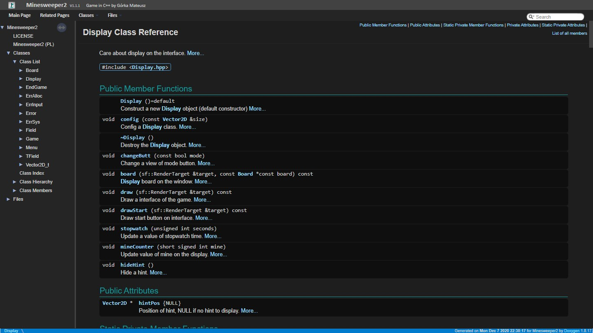

# Doxygen Dark Theme

Theme inspired by the Dark+ theme in the Visual Studio Code editor.

The theme based on Tilen Majerles project on the MIT Licence.
[MaJerle/doxygen-dark-theme](https://github.com/MaJerle/doxygen-dark-theme)

## Preview


## How to change doxygen theme

Just modify 3 linex of doxygen config file (default Doxfile):

```
HTML_EXTRA_STYLESHEET  = "<path>/custom.css"
```

```
HTML_HEADER            = "<path>/html_header.html"
HTML_FOOTER            = "<path>/html_footer.html"
```
